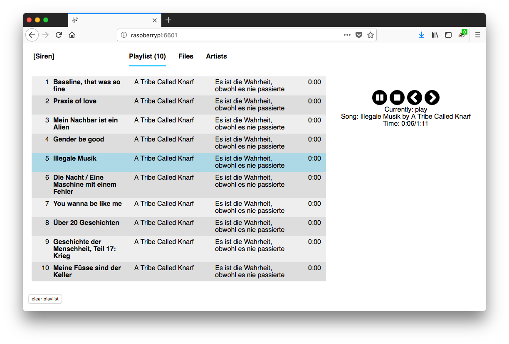
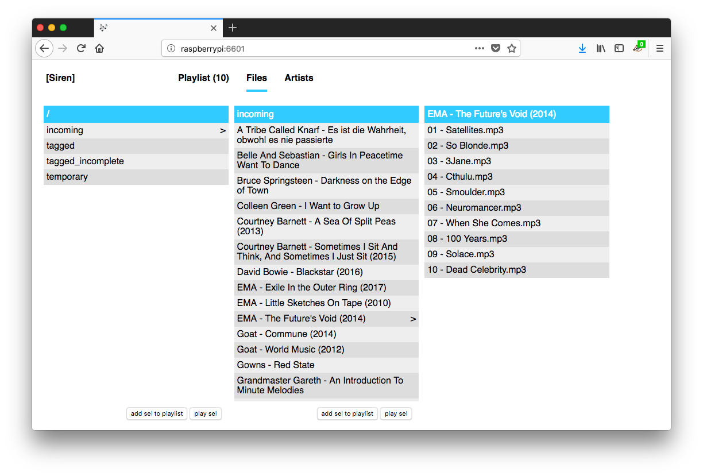

Browser based MPD client.

Made with Elm and `display:grid`.



## Releases

Binary releases are on the [releases](https://github.com/alicebob/siren/releases) page.


## Build

- you need a Go (>=1.9) and an Elm (0.18) compiler
- `make`
- run the binary from ./siren/siren
- open http://localhost:6601/

All resources are bundled in the binary, so you can copy it over to other
machines.


### Raspberry Pi build

Thanks to Go's cross-platform support you can build Siren on your laptop, and copy the executable to your Rasberry Pi.

- you need a Go compiler on your laptop
- `make build-pi`
- copy `siren/siren` to your Raspberry Pi
- open http://your_raspberry:6601/


## Running

Siren connects to the mpd at localhost:6600 by default. Change it with for example: `./siren -mpd=192.168.1.2:6600`

If you don't want to make Siren available to everyone in you subnet, use: `./siren -listen=localhost:6601`

### Artist vs Albumartist

By default Siren uses the `albumartist` field for the artist browse screen. If you want to use the `artist` instead field you can specify that with: `./siren -albumartist=false`.

### NGINX

Suggested nginx config:
```
        location /siren/ { 
                location /siren/mpd/ws { 
                        proxy_set_header Upgrade $http_upgrade; 
                        proxy_set_header Connection "upgrade"; 
                        proxy_http_version 1.1; 
                        proxy_set_header Host $host; 
                        proxy_pass http://127.0.0.1:6601/mpd/ws; 
                } 
                proxy_pass http://127.0.0.1:6601/; 
        } 
```


## Development

Usually the CSS and compiled Elm files are embedded in the executable, but you
can use the filesystem while developing. Run siren with:

`./siren/siren --docroot ./docroot`


## Links

- [Music Player Daemon](https://www.musicpd.org)
- [Elm](https://elm-lang.org)
- [Go](https://golang.org)
